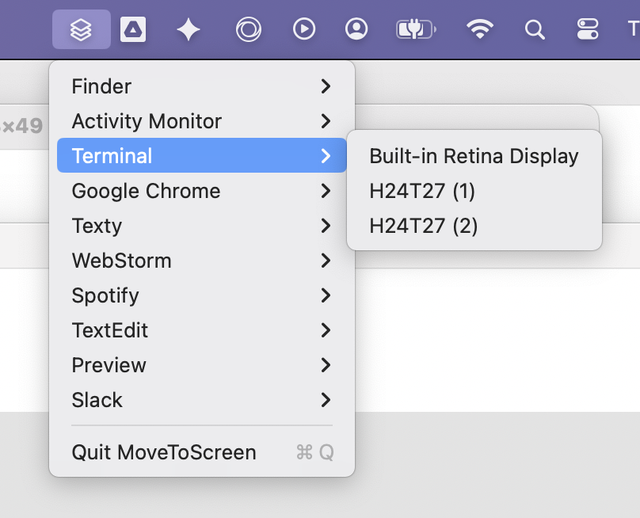

# MoveToScreen

A tiny macOS menu bar utility for sweeping scattered app windows onto one display. Move one app, every app, or just the ones you tick — pick a destination and the windows land there.

If your Terminal windows (or Chrome, or VS Code…) end up spread across two or three screens and you want them back together, this is for you.



---

## Quickstart

Install with [Homebrew](https://brew.sh):

```bash
brew tap wallacedrew/move-to-screen https://github.com/wallacedrew/move-to-screen
brew trust wallacedrew/move-to-screen
brew install move-to-screen
```

Later, to update or remove:

```bash
brew upgrade move-to-screen     # update
brew uninstall move-to-screen   # uninstall
```

Requires Xcode command-line tools (`xcode-select --install`) — Homebrew builds from source. See [Installing](#installing) for the from-source path and first-launch Accessibility setup.

---

## How it works

Click the **MoveToScreen** icon in your menu bar. You'll see three ways to move windows, plus the list of running apps with checkboxes on the left.

### One app's windows

Hover an app row in the list (Finder, Terminal, Chrome, …), then pick a display. Every eligible window of that app moves to the chosen screen.

### Every running app's windows

Hover **Move all windows** at the top of the menu, then pick a display. Useful when you've just plugged in a monitor and want to sweep everything onto it, or when a screen disconnected and your windows scattered.

### A chosen subset of apps

Tick the checkbox to the left of each app you want to move. Once you've ticked two or more, a **Move selected windows ▸** row appears between **Move all windows** and the per-app list. Hover it, pick a display, and only the checked apps move. The selection clears automatically after the move.

All three actions share the same menu — you can mix and match. The menu stays open while you tick checkboxes.

### "Which display is which?"

External displays often show up with cryptic model names like `H24T27 (1)`. Hover any display row in any submenu and a big black-and-white badge appears on the matching physical screen — so you can map the name to the screen before you click.

---

## What gets moved

- Normal visible windows on the current Space.
- Minimized windows (they get un-minimized first).

Each window lands in roughly the same relative position it occupied on its old screen, so a window in the top-left corner of one display ends up in the top-left of the destination.

## What gets skipped

- Fullscreen windows.
- Windows on other Spaces (Mission Control desktops).
- Apps with no movable windows (they don't appear in the menu at all).

---

## Requirements

- **macOS 13 (Ventura) or later**
- Apple Silicon or Intel Mac
- Multiple displays connected (it works with one display too, but that's not the point)

---

## Installing

You'll need [Xcode command-line tools](https://developer.apple.com/xcode/) (run `xcode-select --install` if you don't have them) — both install paths build from source.

### With Homebrew (recommended)

```bash
brew tap wallacedrew/move-to-screen https://github.com/wallacedrew/move-to-screen
brew trust wallacedrew/move-to-screen
brew install move-to-screen
```

The first command registers this repo as a Homebrew tap (one-time). The second tells Homebrew you trust formulae from this tap — required by Homebrew 6.0+ for any third-party tap. The third builds, installs, and launches MoveToScreen. You should see a menu bar icon (three stacked squares) appear within a second or two — no Dock icon, no window.

To update: `brew upgrade move-to-screen`.
To uninstall: `brew uninstall move-to-screen`.

### From source

```bash
git clone https://github.com/wallacedrew/move-to-screen.git
cd move-to-screen
./script/install
```

The script builds the app, installs it to `~/Applications/MoveToScreen.app`, and launches it.

To update later: `git pull && ./script/install`.
To uninstall: `./script/uninstall`.

---

## First launch — granting Accessibility access

MoveToScreen uses macOS's Accessibility API to move other apps' windows. The first time you launch it (and after each fresh build), you'll see a dialog:

> **Enable MoveToScreen in Accessibility**
> System Settings has opened to Privacy & Security → Accessibility. Toggle MoveToScreen on (or add it via **+** if it isn't listed). This dialog closes automatically and the menu bar icon will appear — no need to relaunch.

System Settings opens to the right page automatically. Flip the **MoveToScreen** switch — or, if you don't see it in the list, hit the **+** button and add `~/Applications/MoveToScreen.app`. Within about a quarter-second of granting, the dialog dismisses on its own and the menu bar icon appears. You don't need to quit and relaunch.

This is the same permission required by Rectangle, Magnet, BetterTouchTool, and every other window-management tool on macOS. The app can't move windows without it.

**Why the re-prompt on updates?** macOS ties Accessibility grants to the exact binary signature, and every fresh build produces a new signature. The install script detects this and clears the stale entry so the Settings toggle never lies — it stays "off" until you re-flip it on the new build.

---

## Auto-start at login

Click the menu bar icon → **Open at Login**. A checkmark next to the row means it's enabled. Click again to disable.

On first enable, macOS may surface a Login Items approval dialog. Once approved, MoveToScreen comes back automatically after every reboot.

You can also toggle this from **System Settings → General → Login Items** (look for `MoveToScreen` in the list).

---

## Quitting

Click the menu bar icon → **Quit MoveToScreen**.

---

## Limitations

- Windows on other Spaces are left alone. Switch to that Space first if you want to move them.
- Fullscreen windows can't be moved (macOS owns the geometry).
- The selection state in **Move selected windows** doesn't persist across app restarts — when you quit and relaunch, no apps are checked.
- Not yet code-signed or notarized. The install script launches the app via `open` from your terminal, which sidesteps the "unidentified developer" warning — but if you ever double-click the bundle straight out of Finder before the first script-launch, you'll get that warning. Right-click the bundle → **Open** to bypass it once.

---

## License

MIT.
